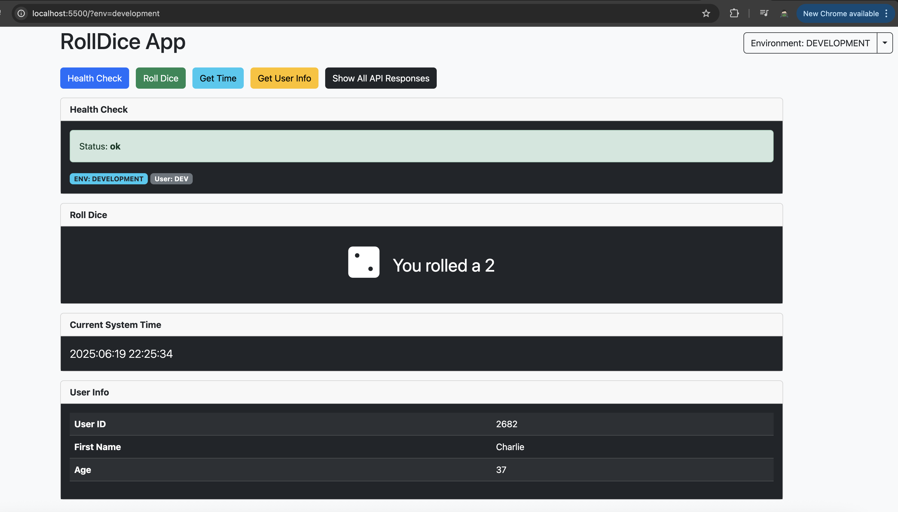
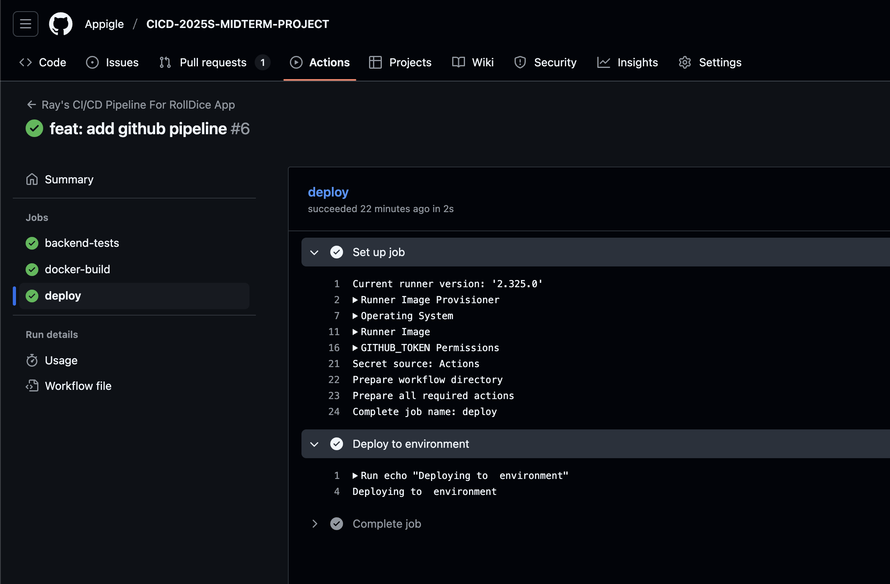

# CICD-2025S-MIDTERM-PROJECT

[](https://github.com/Appigle/CICD-2025S-MIDTERM-PROJECT/actions/workflows/ci.yml)

A PHP-based RollDice application with a modern Bootstrap frontend, containerized with Docker and automated CI/CD pipeline using GitHub Actions.



## Project Overview

RollDice is a web application that provides various API endpoints including a dice rolling simulator, system time retrieval, health check, and user information endpoints. The application is built with PHP backend and HTML/JavaScript frontend.

## Project Structure

```
.
├── backend/
│   ├── public/
│   │   └── index.php          # Main API entry point
│   ├── tests/
│   │   └── ApiTest.php        # PHPUnit test cases
│   ├── composer.json          # PHP dependencies
│   ├── phpcs.xml             # PHP CodeSniffer config
│   ├── phpstan.neon          # Static analysis config
│   └── phpunit.xml           # Test configuration
├── frontend/
│   ├── public/
│   │   ├── index.html        # Bootstrap-based UI
│   │   └── config.js         # Environment configuration
│   └── nginx.conf            # Nginx configuration
└── docker-compose.yml        # Multi-container setup
```

## API Endpoints

- `GET /api/health_check` - Returns service health status
- `GET /api/rolldice` - Returns a random dice roll (1-6)
- `GET /api/get_current_system_time` - Returns current system time
- `GET /api/get_user_info` - Returns user information

## Setup & Dependencies

### Backend Setup

1. Install PHP 8.3 and Composer
2. Navigate to backend directory:
   ```bash
   cd backend
   ```
3. Install dependencies:
   ```bash
   composer install
   ```
4. Set up environment:
   ```bash
   cp .env.development .env  # For development
   # or
   cp .env.production .env  # For production
   ```

### Frontend Setup

1. No build process required - static HTML/JS
2. Configure API URL in `frontend/public/config.js`

## Running the Application

### Local Development

1. Start PHP development server:
   ```bash
   cd backend
   php -S localhost:8000 -t public
   ```
2. Open frontend:
   ```bash
   open frontend/public/index.html
   ```

### Using Docker

1. Build and start services:
   ```bash
   docker-compose up --build
   ```
2. Access the application:
   - Frontend: http://localhost:5500
   - Backend API: http://localhost:8000/api
   - Health Check: http://localhost:8000/api/health_check

## Docker Image


### Pulling the Image

```bash
# Pull latest version
docker pull ghcr.io/owner/repo:main

# Pull specific version
docker pull ghcr.io/owner/repo:v1.0.0
```

### Running the Container

```bash
docker run -d \
  -p 8000:80 \
  -e ENV=production \
  -e ENV_NAME=PRODUCTION \
  -e CORS_ALLOWED_ORIGINS=https://your-domain.com \
  ghcr.io/owner/repo:main
```

## CI/CD Pipeline

Our GitHub Actions pipeline automates testing, building, and deployment processes.


### Pipeline Stages

1. **Backend Tests**

   - Composer validation
   - PHPUnit tests
   - Code style (PSR-12)
   - Static analysis (PHPStan)

2. **Docker Build**

   - Multi-platform build
   - Automated tagging
   - Push to GitHub Container Registry

3. **Deployment**
   - Environment-specific deployment
   - Manual approval for production

### Triggering the Pipeline

#### Automated Triggers

- Push to main branch
- Pull request creation/update

### Environment Configuration

The application supports multiple environments through:

- `.env.development` - Development settings
- `.env.production` - Production settings
- `.env` - Default fallback

## Testing


Run the test suite:

```bash
cd backend
composer test
```

Run code quality checks:

```bash
composer lint      # Code style check
composer lint:fix  # Auto-fix code style
composer analyze   # Static analysis
```

## License

MIT License - See LICENSE file for details.
